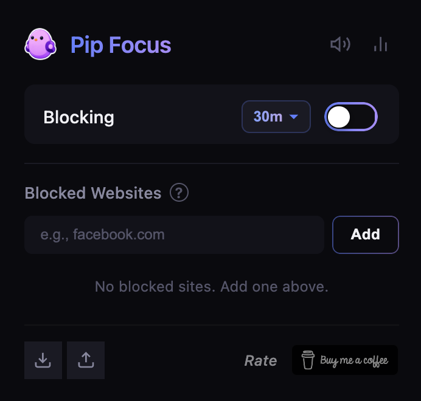
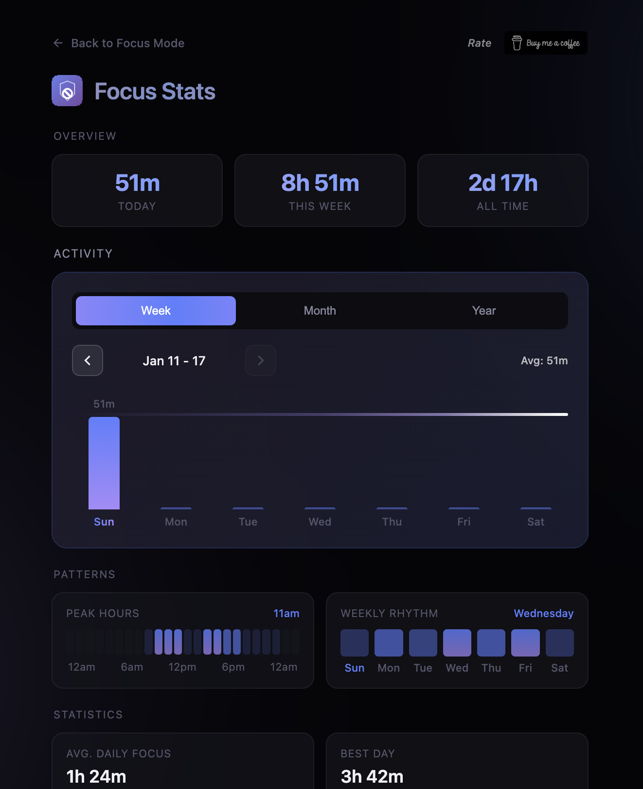
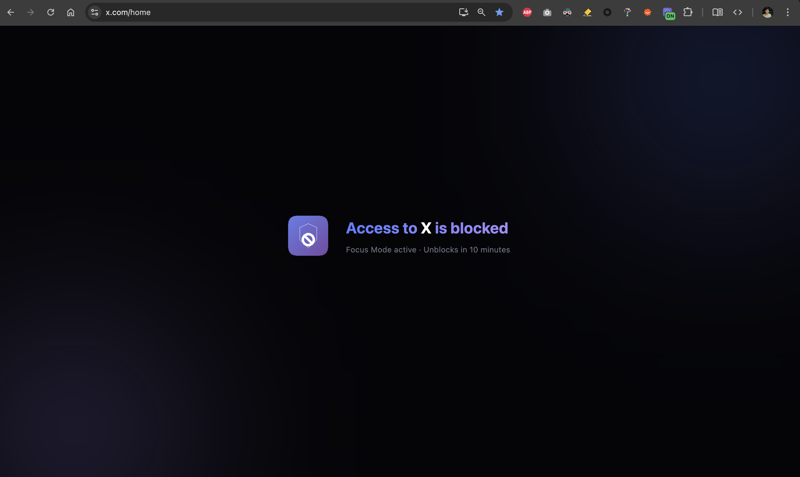

# Focus Mode

One simple thing, done well.

A Chrome extension that blocks distracting websites to help you stay focused.

## Screenshots

  
  

  

## Features

- **One-click blocking** — Toggle focus mode instantly
- **Custom block list** — Block any website (YouTube, Twitter, Reddit, etc.)
- **Flexible timers** — 5min to 2hrs, custom duration, or infinite
- **Focus stats** — Track daily, weekly, monthly focus time
- **Streak tracking** — See current and best focus streaks
- **Hold to disable** — Prevents accidental turn-off during sessions
- **Smart wildcards** — `*youtube.com` blocks all subdomains, `https://youtube.com` blocks exact match only, doesn't block `music.youtube.com`
- **Minimal block page** — Clean overlay, no distractions
- **Import/Export** — Backup and restore your settings and stats
- **100% private** — No data collection, no tracking, no ads, fully local

## Install

**Chrome Web Store**: [Install Focus Mode](https://chromewebstore.google.com/detail/focus-mode/ijgbeipckbajgnkjgdhoponeenjdnimn)

**Manual**: Clone repo → In chrome, go to `chrome://extensions` → Enable Developer Mode → Load unpacked → Select the cloned repo

## Privacy

- No data collection or analytics
- No ads
- No external servers
- 100% local storage
- Open source

[Full Privacy Policy](PRIVACY.md)

## License

MIT License

---

Built for myself. Maybe useful for you too.
